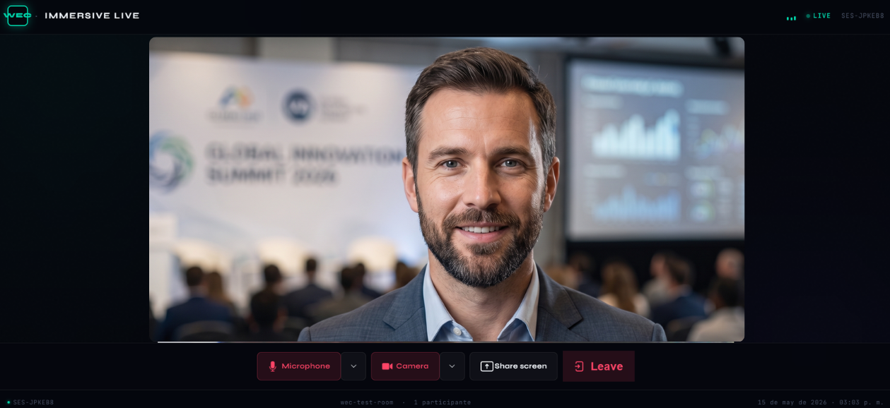

<div align="center">

<br/>

# 🎥 WEC Immersive Live

### Videoconferencias en tiempo real, inmersivas y de alta calidad

<br/>

[](https://reactjs.org/)
[](https://vitejs.dev/)
[](https://livekit.io/)
[](https://nodejs.org/)
[](./LICENSE)

<br/>

> Sala de videoconferencias estilo Zoom, construida con **React + LiveKit**. Diseño oscuro, moderno e inmersivo con WebRTC de baja latencia, Picture-in-Picture inteligente y grilla de participantes dinámica.

---

</div>

<br/>

## 📸 Capturas de Pantalla

<div align="center">

<br/>

### Sala Principal — Vista de la Interfaz

<br/>



<br/><br/>

> *Interfaz inmersiva con grilla de participantes dinámica, controles de medios y modo Picture-in-Picture.*

<br/>

</div>

---

<br/>

## 📖 ¿Qué es WEC Immersive Live?

**WEC Immersive Live** es una aplicación de videoconferencias en tiempo real construida para ofrecer una experiencia inmersiva, fluida y moderna. Está diseñada con una interfaz oscura y sofisticada que combina la potencia de **WebRTC** (a través de LiveKit) con un frontend en React altamente optimizado.

Pensada para equipos que buscan una solución de comunicación que se sienta profesional sin sacrificar la experiencia de usuario.

<br/>

## 🚀 Características Principales

| Característica | Descripción |
|---|---|
| ⚡ **WebRTC de Baja Latencia** | Streaming en tiempo real impulsado por LiveKit Cloud. |
| 🖼️ **Picture-in-Picture Inteligente** | Tu cámara aparece en la grilla cuando estás solo; con más participantes, se convierte en un minimapa flotante e interactivo. |
| 🎨 **UI/UX Inmersivo** | Diseño oscuro personalizado con animaciones CSS, avatares de estado y controles optimizados. |
| 🎛️ **Gestión Completa de Sala** | Controles de micrófono, cámara, compartir pantalla y salida de sala. |
| 👥 **Grilla Dinámica** | La distribución de participantes se adapta automáticamente al número de usuarios en sala. |
| 🛡️ **Degradación Elegante** | Manejo sin fricciones de estados de carga, salas vacías y errores de autenticación. |

<br/>

---

## 🛠️ Stack Tecnológico

```
┌─────────────────────────────────────────────────────┐
│                  WEC Immersive Live                 │
├──────────────────────┬──────────────────────────────┤
│      Frontend        │         Backend (Auth)        │
│  React + Vite        │  Node.js + Express            │
│  LiveKit Components  │  LiveKit Server SDK           │
│  LiveKit Styles      │  Generación de Access Tokens  │
├──────────────────────┴──────────────────────────────┤
│              Infraestructura WebRTC                 │
│                  LiveKit Cloud                      │
└─────────────────────────────────────────────────────┘
```

| Capa | Tecnología |
|---|---|
| **Frontend** | React, Vite, `@livekit/components-react`, `@livekit/components-styles` |
| **Backend** | Node.js, Express, LiveKit Server SDK |
| **Infraestructura** | LiveKit Cloud (WebRTC) |
| **Despliegue sugerido** | Vercel (Frontend) · Render (Backend) |

<br/>

---

## ⚙️ Requisitos Previos

Antes de comenzar, asegúrate de tener:

- **[Node.js](https://nodejs.org/) v18+** — Runtime de JavaScript
- **NPM o Yarn** — Gestor de paquetes
- **Cuenta en [LiveKit Cloud](https://cloud.livekit.io/)** — Necesitas tu `API Key` y `API Secret`

<br/>

---

## 💻 Instalación y Uso Local

El proyecto tiene dos partes que deben ejecutarse en paralelo: el **servidor de tokens** (backend) y el **cliente React** (frontend).

<br/>

### Paso 1 — Clonar el repositorio

```bash
git clone https://github.com/tu-usuario/wec-immersive-live.git
cd wec-immersive-live
```

<br/>

### Paso 2 — Configurar y levantar el Backend

El cliente solicita tokens de acceso a `http://localhost:3000/api/token`.

```bash
# Navega al directorio del servidor
cd server

# Instala las dependencias
npm install
```

Crea el archivo de variables de entorno:

```bash
# server/.env
LIVEKIT_API_KEY=tu_api_key
LIVEKIT_API_SECRET=tu_api_secret
```

Inicia el servidor:

```bash
npm run dev
# ✓ Servidor escuchando en http://localhost:3000
```

<br/>

### Paso 3 — Configurar y levantar el Frontend

```bash
# Abre una nueva terminal y navega al cliente
cd client

# Instala las dependencias
npm install

# Inicia el servidor de desarrollo
npm run dev
# ✓ Aplicación disponible en http://localhost:5173
```

<br/>

> **💡 Tip:** Necesitas tener ambos procesos (backend y frontend) corriendo al mismo tiempo para que la app funcione correctamente.

<br/>

---

## 🌐 Despliegue a Producción

Cuando lleves la aplicación a producción, actualiza las URLs del frontend para que apunten a tus dominios reales en lugar de `localhost`.

<br/>

### Frontend — Vercel

1. Conecta tu repositorio a [Vercel](https://vercel.com/).
2. Establece el **directorio raíz** en `client/`.
3. Configura el **comando de build**: `npm run build`.
4. Establece el **directorio de salida**: `dist`.
5. Actualiza la URL del backend en el código fuente del cliente.

<br/>

### Backend — Render

1. Crea un nuevo **Web Service** en [Render](https://render.com/).
2. Conecta el repositorio y apunta al directorio `server/`.
3. Agrega las variables de entorno desde el panel:
   - `LIVEKIT_API_KEY`
   - `LIVEKIT_API_SECRET`

<br/>

---

## 📁 Estructura del Proyecto

```
wec-immersive-live/
│
├── 📂 client/                  # Aplicación React (Frontend)
│   ├── 📂 src/
│   │   ├── 📂 components/      # Componentes de UI
│   │   │   ├── VideoGrid.jsx   # Grilla dinámica de participantes
│   │   │   ├── PiPView.jsx     # Picture-in-Picture flotante
│   │   │   └── Controls.jsx    # Barra de controles de sala
│   │   ├── App.jsx
│   │   └── main.jsx
│   ├── index.html
│   └── package.json
│
├── 📂 server/                  # API de Tokens (Backend)
│   ├── index.js                # Servidor Express + generación de tokens
│   ├── .env                    # Variables de entorno (no commitear)
│   └── package.json
│
├── 📂 assets/                  # Recursos estáticos del README
│   └── UI.png
│
└── README.md
```

<br/>

---

## 🤝 Contribuciones

¡Las contribuciones son bienvenidas y apreciadas! Sigue estos pasos:

1. **Abre un issue** describiendo el cambio o mejora que propones: [Nuevo Issue](../../issues)
2. **Haz un fork** del repositorio y crea tu rama:
   ```bash
   git checkout -b feature/mi-mejora
   ```
3. **Realiza tus cambios** y haz commit siguiendo [Conventional Commits](https://www.conventionalcommits.org/):
   ```bash
   git commit -m 'feat: agrega soporte para salas privadas'
   ```
4. **Envía tu Pull Request** y describe los cambios realizados.

<br/>

---

## 📄 Licencia

Distribuido bajo la licencia **MIT**. Consulta el archivo [`LICENSE`](./LICENSE) para más información.

<br/>

---

<div align="center">

<br/>

Desarrollado con ❤️ por **[Yerson Rodriguez](https://github.com/YersonRodriguez2005)**

<br/>

⭐ Si este proyecto te fue útil, considera darle una estrella en GitHub

<br/>

</div>